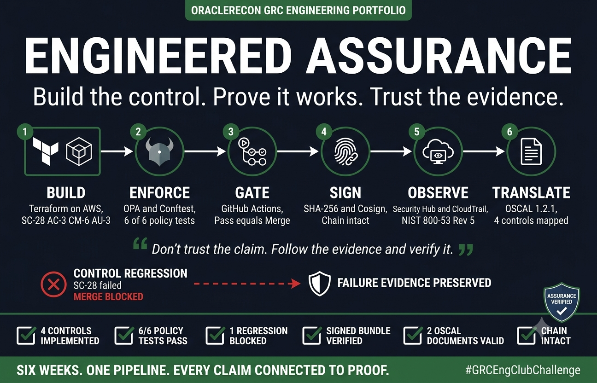
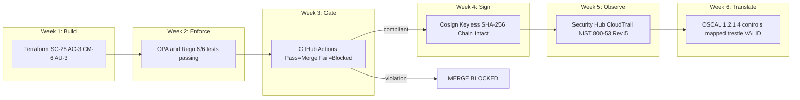

# GRC Engineering Pipeline

**Build the control. Block the regression. Verify the proof.**

An end-to-end, evidence-first demonstration of engineered assurance. Terraform defines compliant AWS storage. Rego tests the plan before deployment. GitHub Actions blocks noncompliant pull requests. Cosign signs the resulting evidence with a keyless cryptographic chain of custody. OSCAL makes every control claim traversable by an assessor without screenshots or manual steps.

Start here: read the [portfolio case study](PORTFOLIO-CASE-STUDY.md), then follow each claim to its proof.




---

## Pipeline

| Stage | Capability | Location |
|-------|-----------|----------|
| 1 | Terraform implements SC-28, AC-3, CM-6, and AU-3 on AWS S3 | `terraform/` |
| 2 | Rego policies test the Terraform plan — 6 of 6 passing | `policies/` |
| 3 | GitHub Actions gates every pull request and blocks noncompliant merges | `.github/workflows/grc-gate.yml` |
| 4 | Gate evidence is hashed, keyless-signed with Cosign, and tamper-verified | `verify-evidence.sh` |
| 5 | OSCAL maps all four controls to resources and signed evidence | `oscal/` |

---

## Architecture



---

## Verifiable highlights

A compliant pull request passed the gate and merged cleanly.

A deliberate SC-28 regression (encryption block removed) was blocked at the platform level by branch protection. The failing check is visible in the PR history and the evidence artifact was preserved.

The tamper test proves one appended byte breaks the cryptographic chain immediately, with CHAIN INTACT on the real bundle and FAIL hash mismatch on the tampered copy side by side.

Two OSCAL documents validated with `trestle validate` returning VALID on both.

---

## Controls implemented

**SC-28 Protection of Information at Rest**
All S3 buckets enforce AES-256 server-side encryption via `aws_s3_bucket_server_side_encryption_configuration`. Validated by `policies/sc28_encryption_aws.rego` using reference matching at plan time.

**AC-3 Access Enforcement**
All S3 buckets block all four public access vectors via `aws_s3_bucket_public_access_block`. Validated by `policies/ac3_no_public_aws.rego`.

**CM-6 Configuration Settings**
All taggable resources carry four required compliance tags (Project, Environment, ManagedBy, ComplianceScope) enforced through provider `default_tags`. Validated by `policies/cm6_required_tags_aws.rego`.

**AU-3 Content of Audit Records**
CloudTrail deployed with multi-region coverage, global service events, and log file validation via `aws_cloudtrail`.

---

## Verify locally

Prerequisites: Python 3, OPA, Conftest, and Cosign.

Run the policy tests:

```
opa test policies/ -v
```

Run Conftest against the committed plan:

```
conftest test evidence/plan.json --policy policies --namespace compliance.sc28_aws
conftest test evidence/plan.json --policy policies --namespace compliance.ac3_aws
conftest test evidence/plan.json --policy policies --namespace compliance.cm6_aws
```

Validate the OSCAL documents:

```
pip install compliance-trestle==4.2.0
trestle validate -f oscal/component-definitions/my-pipeline/component-definition.json
trestle validate -f oscal/profiles/nist-800-53-selection/profile.json
```

Both OSCAL commands must report VALID.

---

## Proof links

Green PR (all controls passing, merged): https://github.com/doneal78/grc-club-week3/pull/1

Red PR (SC-28 regression blocked by branch protection): https://github.com/doneal78/grc-club-week3/pull/2

Policy tests 6/6 passing: https://github.com/doneal78/grc-club-week2

Signed evidence with CHAIN INTACT: https://github.com/doneal78/grc-club-week3/actions

---

## Related portfolio work

GRC Compliance Checker: https://github.com/doneal78/grc-compliance-checker

Terraform Compliance Baseline: https://github.com/doneal78/grc-terraform-baseline

SOC 2 Evidence Pipeline: https://github.com/doneal78/grc-soc2-pipeline

Weekly Challenges: https://github.com/doneal78/grc-club-week1 | https://github.com/doneal78/grc-club-week2 | https://github.com/doneal78/grc-club-week5 | https://github.com/doneal78/grc-club-week6

---

## Built by

David O'Neal — Cybersecurity PM at Legato Security, pivoting to GRC Engineering.

LinkedIn: https://www.linkedin.com/in/david-oneal
